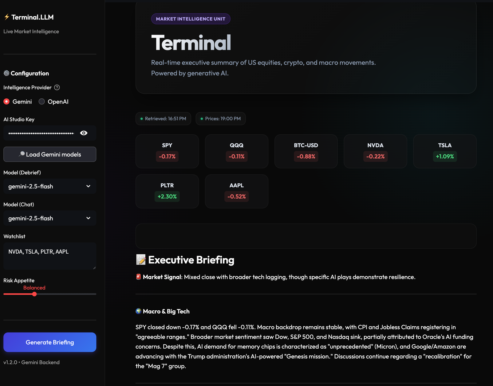

# Terminal.LLM

`Terminal.LLM` is a Streamlit app that pulls *live* market context (prices + headlines) via Yahoo Finance (`yfinance`) and generates a “Morning Debrief” using either **Gemini** or **OpenAI**.

Live app (Reboot it if dormant):
- https://terminalllm.streamlit.app/

## Idea

Terminal.LLM is a simple “mini Bloomberg Terminal” for a daily market briefing — hence **Terminal**, but powered by an **LLM**.

Most AI market summaries are either generic or drift into guesswork because they aren’t tied to the latest tape/news. Terminal.LLM keeps the model grounded by:

- Fetching a small, structured “context snapshot” (prices + headlines) on demand
- Displaying *retrieved* and best-effort *as-of* timestamps for transparency
- Letting users choose their provider/model (Gemini or OpenAI) without changing the workflow

The goal is a fast, terminal-like loop: refresh → read the brief → ask follow-ups.

## Screenshot



Main code:
- `app.py` — Streamlit UI + LLM integration (Gemini/OpenAI switch)
- `data_fetcher.py` — market data + news retrieval (yfinance) with “retrieved at” timestamps

Debug/utility scripts (optional):
- `check_models.py` — quick SDK sanity check for Gemini model listing
- `debug_news.py` — prints raw Yahoo news item structure from yfinance

---

## Features

- Watchlist + risk profile inputs
- “Freshness” timestamps shown in the UI (retrieved time + best-effort “as-of” times)
- Quick market tape (SPY/QQQ/BTC + a few watchlist tickers)
- Follow-up chat that uses the same provider/model as the debrief

---

## Requirements

- Python **3.10+** (recommended: 3.12)

Python packages:
- `streamlit`
- `yfinance`
- **One** of:
  - `google-generativeai` (Gemini)
  - `openai` (OpenAI)

You can install both SDKs to easily switch providers in the UI.

---

## Setup (recommended: virtualenv)

From the repo folder:

```bash
cd "/path/to/LLM Terminal"

python3.12 -m venv .venv
source .venv/bin/activate

python -m pip install -U pip
python -m pip install streamlit yfinance google-generativeai openai
```

---

## Run the app

```bash
streamlit run app.py
```

In the sidebar:
1. Choose `LLM Provider` (`Gemini` or `OpenAI`)
2. Paste your API key
3. (Optional) Click `Load Gemini models` / `Load OpenAI models` to populate the model dropdowns
4. Pick your `Model (Debrief)` and `Model (Chat)`
5. Click `Generate Briefing` to fetch fresh context and generate the debrief

---

## How the data works (`data_fetcher.py`)

`get_market_data(watchlist)` returns a JSON-like dict containing:

- `retrieved_at`: when the fetch finished (local timezone, ISO 8601)
- `retrieval_window.started_at/finished_at`: to show the actual fetch window
- `source_as_of.prices_as_of`: timestamp of the most recent price bar seen (best-effort)
- `source_as_of.news_as_of`: most recent publish time seen in fetched items (best-effort)
- `market_context`: percent change from **today’s open** to most recent close/bar
- `headlines`: a small set of “macro” + watchlist headlines

You can run the fetcher directly:

```bash
python data_fetcher.py
```

---

## Notes / Troubleshooting

- If you see `ModuleNotFoundError`, install the missing package in the same environment you use to run Streamlit:
  - `python -m pip install <package>`
- If your virtualenv is using Python 3.9 (or older), recreate it using Python 3.10+:
  - `rm -rf .venv && python3.12 -m venv .venv`
- Yahoo Finance data can be delayed/incomplete depending on ticker/market hours. The app displays both “retrieved” time and best-effort “as-of” times to make this clear.
